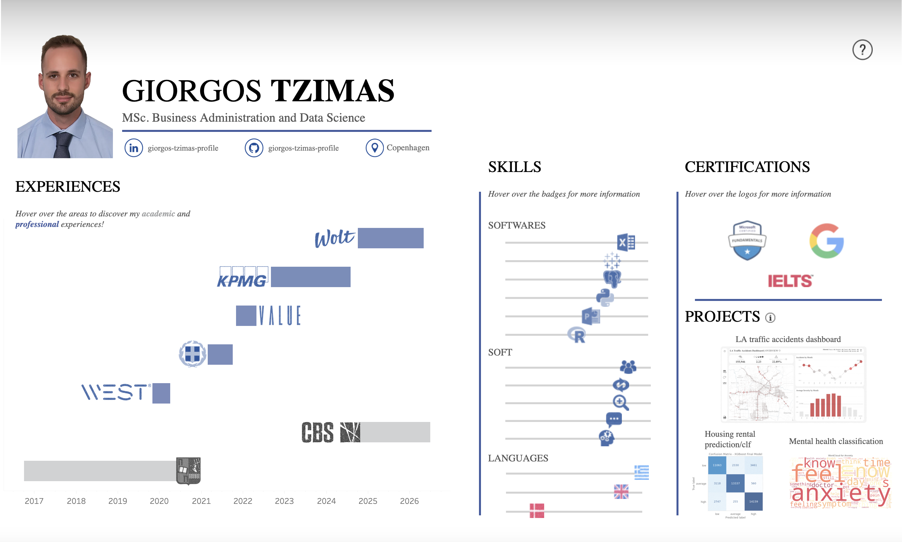

# Interactive Tableau CV

This repository contains a more fun and interactive version of my CV using Tableau.  

## How to View

View the interactive dashboard by pressing <a href="https://public.tableau.com/app/profile/giorgos.tzimas4984/viz/GiorgosTzimasCV/Dashboard2" style="text-decoration: underline;">**here**</a>

## Overview

## Purpose

This project demonstrates:

- Data visualization skills  
- Ability to structure and present information in a clear and minimal way at the same time
- Use of Tableau for storytelling and dashboard design  

## Notes

Some content may be simplified compared to a traditional CV  

## Contact

If you have questions or would like to connect, feel free to reach out.
